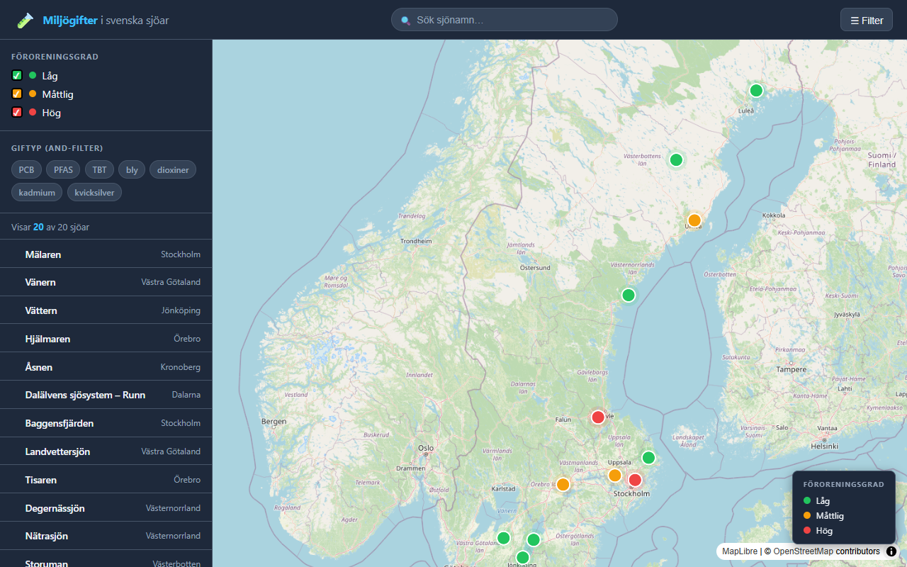

# Miljögifter i svenska sjöar 🧪

En interaktiv webbkarta som visualiserar förekomst av miljögifter i svenska sjöar. Kartan gör det enkelt att se vilka sjöar som är påverkade av ämnen som PFAS, kvicksilver, PCB och kadmium — och i vilken grad.

Miljögifter i sjöar är ett allvarligt folkhälso- och miljöproblem. Många ämnen anrikas i näringskedjan och når slutligen människan via fisk och dricksvatten. Genom att visualisera data geografiskt kan allmänhet, journalister och beslutsfattare snabbt få en överblick över läget i hela landet.



---

## Funktioner

- **Klickbara sjömarkörer** — popup med namn, län, föroreningsgrad, uppmätta gifter och senaste provtagningsdatum
- **Färgkodning efter föroreningsgrad** — grön (låg) / gul (måttlig) / röd (hög)
- **Filtrera på giftyp** — välj ett eller flera ämnen (AND-logik) för att bara visa berörda sjöar
- **Filtrera på föroreningsgrad** — kryssa i/ur låg, måttlig och/eller hög
- **Realtidssökning** — sök på sjönamn direkt i sökfältet
- **Klickbar sjölista** — klicka på en sjö i sidopanelen för att flyga dit på kartan
- **Responsiv layout** — fungerar på både desktop och mobil

---

## Tekniker

| Teknik | Användning |
|---|---|
| [MapLibre GL JS](https://maplibre.org/) | Kartrendering och lagerhantering |
| OpenStreetMap | Bakgrundskarta via gratis tile-tjänst |
| GeoJSON | Dataformat för sjöar och attribut |
| Vanilla JavaScript | Kartlogik, filtrering och sökning |
| CSS (custom properties) | Mörkt tema, responsiv layout |

Inga byggsteg, inga beroenden att installera — allt laddas direkt i webbläsaren.

---

## Kom igång

```bash
# Klona repot
git clone https://github.com/ulfboge/miljogifter-500.git
cd miljogifter-500
```

Öppna sedan `index.html` i valfri webbläsare. Eftersom kartan läser GeoJSON-data via `fetch()` behöver du köra den via en lokal HTTP-server (inte direkt som `file://`):

```bash
# Med Python (finns förinstallerat på de flesta system)
python -m http.server 8000

# Med Node.js / npx
npx serve .
```

Gå sedan till `http://localhost:8000` (eller anvisad port) i webbläsaren.

---

## Datastruktur

Varje sjö i `data/sjoar.geojson` innehåller följande fält:

```json
{
  "namn": "Mälaren",
  "foroReningsgrad": "måttlig",
  "gifter": ["PFAS", "kvicksilver", "PCB"],
  "senast_provtagen": "2024-08-15",
  "lan": "Stockholm"
}
```

### Datakällor

Kartan använder för närvarande **exempeldata** i illustrativt syfte. Planerad integration med officiella datakällor:

- [SMHI](https://www.smhi.se/) — vattenkvalitetsdata och hydrologiska mätningar
- [VISS](https://viss.lansstyrelsen.se/) — Vatteninformationssystem Sverige (Länsstyrelserna)
- [HaV](https://www.havochvatten.se/) — Havs- och vattenmyndigheten, nationell miljöövervakning

---

## Licens

[MIT](LICENSE) © 2025 Ulf Boge
